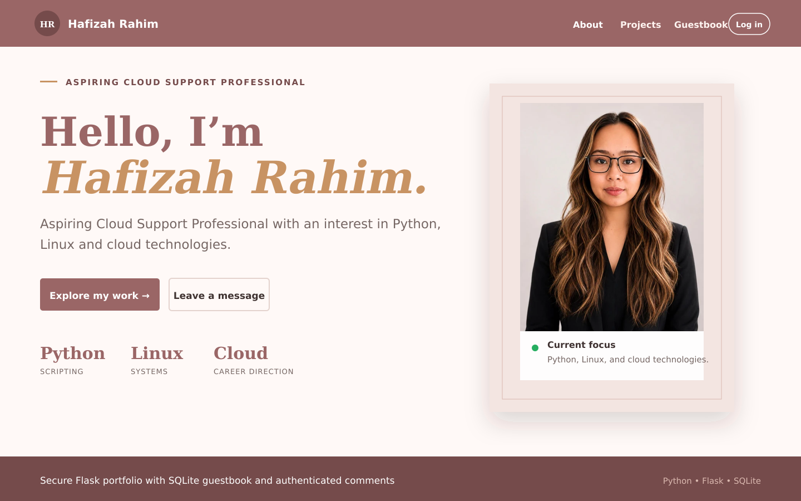
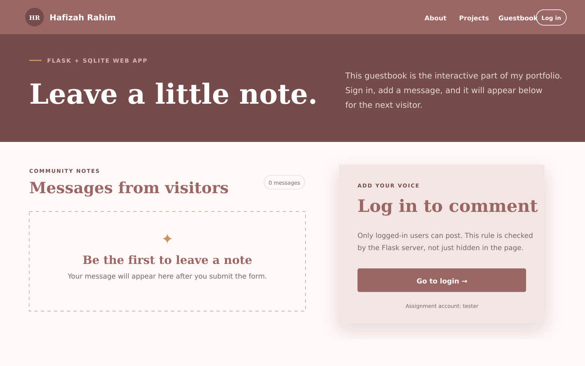

# Secure Flask Portfolio & Guestbook

A responsive portfolio website with an authenticated, SQLite-backed guestbook. It continues Mini Project A by adding database users, login/logout sessions, password hashing, and server-side access control for posting comments.

The profile presents Hafizah as an aspiring Cloud Support Professional with an interest in Python, Linux, and cloud technologies. Its visual identity uses a warm mocha-rose palette supplied by Hafizah.

## Project Overview

This project is a responsive personal portfolio and secure guestbook application built with Python and Flask. It allows visitors to explore portfolio content, while authenticated users can log in and post comments to the guestbook.

The project demonstrates web development, database management, authentication, password security, server-side validation, responsive design, and automated testing.

## Project Previews

### Portfolio Homepage



### Secure Guestbook



## Technologies Used

- Python
- Flask
- Flask-SQLAlchemy
- Flask-Login
- SQLite
- HTML
- CSS
- JavaScript
- Git and GitHub
- Pytest

## Key Features

- Responsive personal portfolio pages
- Secure user login and logout
- Password hashing instead of plain-text password storage
- Authenticated guestbook comments
- Server-side access control and input validation
- SQLite database for users and comments
- Custom 404 error page
- Automated application tests

## Author and Contributor

**Hafizah Rahim**

- GitHub: [hafizah-cloud](https://github.com/hafizah-cloud)
- LinkedIn: [Hafizah Rahim](https://www.linkedin.com/in/hafizah-rahim-427a16327/)
- Project source code: [flask-personal-website](https://github.com/hafizah-cloud/flask-personal-website)

This is an individual project created as part of my Cloud Support and DevOps learning journey.

## Assignment checklist

- [x] Portfolio website built with Python and Flask
- [x] Name and LinkedIn link included and easy to customise
- [x] Separate portfolio, projects, and interactive web-app pages
- [x] Login and logout backed by a `users` database table
- [x] Passwords stored as secure one-way hashes, never as plain text
- [x] Only logged-in users can post comments (enforced by the server)
- [x] Comment author comes from the authenticated session, not a form field
- [x] Required `tester` / `super-secret` assignment account created automatically
- [x] Comments and users saved in SQLite (works on a free PythonAnywhere account)
- [x] Separate introduction page completes Bonus Task A
- [x] Source ready to manage with Git/GitHub
- [x] Responsive, keyboard-friendly design
- [x] Automated tests for authentication, authorisation, validation, storage, redirects, 404 handling, and HTML escaping

## Customise first

The portfolio is personalised for **Hafizah**. Before publishing, set the following environment variables in the PythonAnywhere WSGI file (deployment example below):

```python
os.environ["SITE_OWNER"] = "Hafizah"
os.environ["LINKEDIN_URL"] = "https://www.linkedin.com/in/hafizah-rahim-427a16327/"
```

The initials update automatically from the name. The biography and project descriptions are deliberately limited to what this project demonstrates, so they do not claim qualifications or experience that have not been provided.

## Run locally

Open a terminal in this folder, then run:

```bash
python -m venv .venv
```

Activate the environment:

- Windows PowerShell: `.venv\Scripts\Activate.ps1`
- macOS/Linux: `source .venv/bin/activate`

Install and launch:

```bash
pip install -r requirements.txt
python app.py
```

Visit `http://127.0.0.1:5000`. The app creates `instance/comments.db` automatically on first launch.

Use the required assignment account to test the protected guestbook:

- Username: `tester`
- Password: `super-secret`

The app hashes this password before saving it. If a `tester` user already exists, startup leaves that record unchanged.

## Run the tests

```bash
pip install -r requirements-dev.txt
pytest -q
```

## Put the project on GitHub

Create an empty GitHub repository, then run these commands from the project folder. Replace the example address with your repository URL.

```bash
git init
git add .
git commit -m "Complete Mini Project B authentication"
git branch -M main
git remote add origin https://github.com/hafizah-cloud/flask-personal-website.git
git push -u origin main
```

## Deploy to a free PythonAnywhere account

1. Create a Beginner account and open a **Bash console**.
2. Clone the project and install its packages:

   ```bash
   git clone https://github.com/hafizah-cloud/flask-personal-website.git
   cd flask-personal-website
   python3 -m venv .venv
   source .venv/bin/activate
   pip install -r requirements.txt
   ```

3. Open PythonAnywhere’s **Web** tab, choose **Add a new web app**, choose **Manual configuration**, and select an available Python version.
4. In the Web tab, set **Virtualenv** to `/home/YOUR-PYTHONANYWHERE-USERNAME/flask-personal-website/.venv`.
5. Open the WSGI configuration file and replace its Flask section with:

   ```python
   import os
   import sys

   project_home = "/home/YOUR-PYTHONANYWHERE-USERNAME/flask-personal-website"
   if project_home not in sys.path:
       sys.path.insert(0, project_home)

   os.environ["SECRET_KEY"] = "replace-this-with-a-long-random-value"
   os.environ["SITE_OWNER"] = "Hafizah Rahim"
   os.environ["LINKEDIN_URL"] = "https://www.linkedin.com/in/hafizah-rahim-427a16327/"
   os.environ["DEMO_USERNAME"] = "tester"
   os.environ["DEMO_PASSWORD"] = "super-secret"
   os.environ["COOKIE_SECURE"] = "1"

   from app import app as application
   ```

6. In the Web tab, add this static-files mapping:
   - URL: `/static/`
   - Directory: `/home/YOUR-PYTHONANYWHERE-USERNAME/flask-personal-website/static/`
7. Click **Reload**, then open the website link shown at the top of the Web tab.

No MySQL account is required. The app uses SQLite and creates the database at `/home/YOUR-PYTHONANYWHERE-USERNAME/flask-personal-website/instance/comments.db`. Choose a long, random `SECRET_KEY`; changing it later will sign out existing sessions.

## Project structure

```text
flask-portfolio/
├── app.py                  # User/comment models, login, routes, validation
├── requirements.txt        # Runtime packages
├── requirements-dev.txt    # Test packages
├── templates/              # Jinja pages, including login.html
├── static/css/style.css    # Responsive visual design
├── static/js/main.js       # Menu, year, character counter
├── tests/test_app.py       # Automated tests
└── instance/comments.db    # Created locally at runtime; not committed
```

## How the SQLite code replaces MySQL

The assignment note asks free PythonAnywhere users to use SQLite. This project already does that in `app.py`:

```python
SQLALCHEMY_DATABASE_URI = "sqlite:////absolute/path/to/comments.db"
```

The actual default path is built from Flask’s instance folder so it works on Windows, macOS, Linux, and PythonAnywhere without editing an absolute path. `db.create_all()` runs inside the application context during startup, so both the existing `comment` table and the new `users` table are available automatically. Existing Mini Project A comments remain compatible because authenticated usernames are saved in the original comment `name` column.

## How access control works

`Flask-Login` stores the signed-in user ID in Flask’s signed session cookie. The `@login_required` decorator protects the comment POST route on the server, so manually crafted anonymous requests are redirected to login. The username saved with a comment comes from `current_user.username`; a visitor cannot forge a different author by changing the HTML form. Werkzeug’s password helpers generate and verify the database hash.
